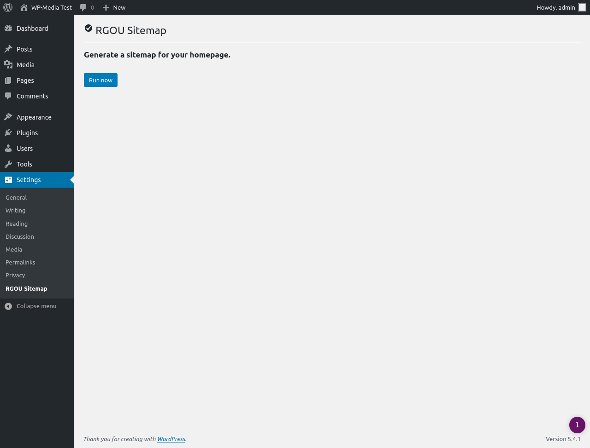
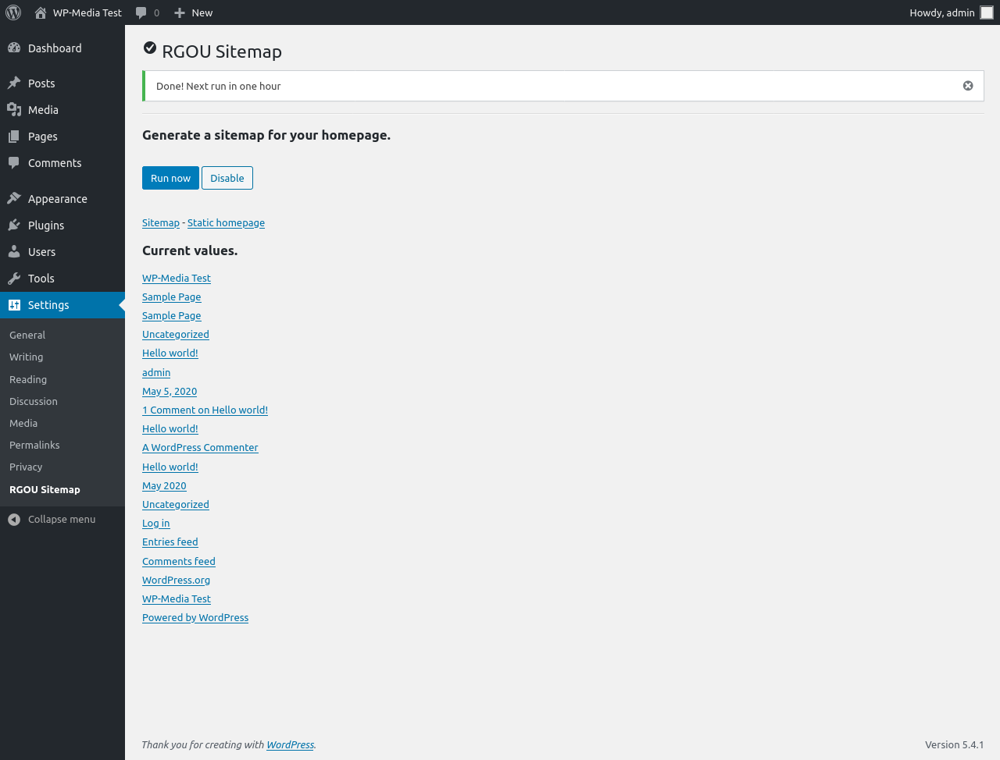
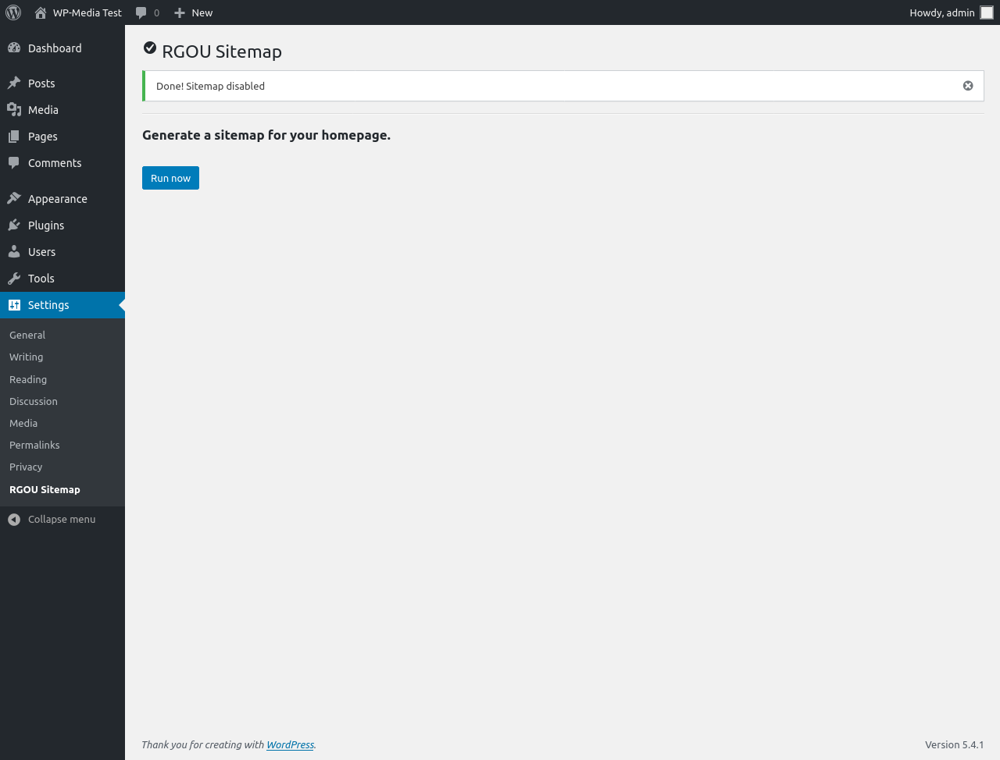
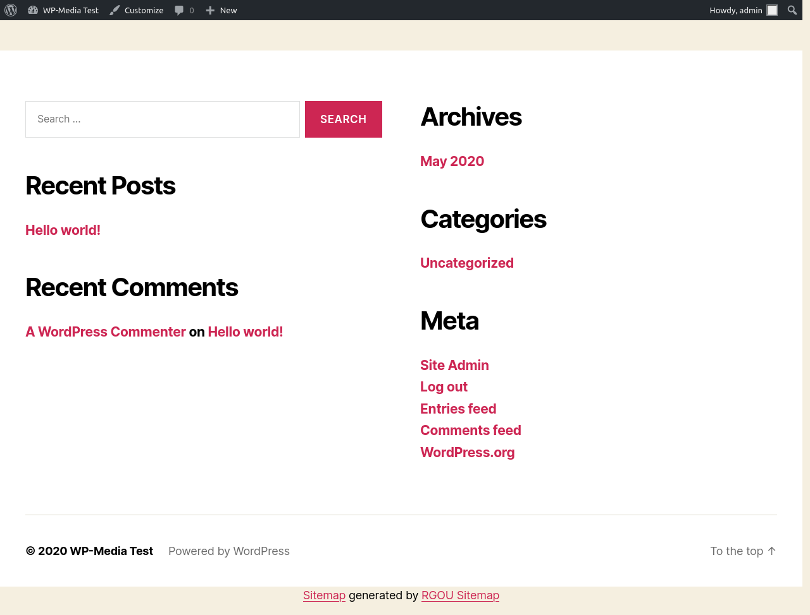

# RGOU Sitemap

Homepage Crawler and Sitemap generator for WP-Media Technical Assessment

[](https://travis-ci.com/rafaelgou/rgou-wp-media)

## Description

Homepage Crawler and Sitemap generator for WP-Media Technical Assessment

## Installation

```bash
cd wp-contents/plugins
wget https://github.com/rafaelgou/rgou-wp-media/archive/master.zip
unzip master.zip
mv rgou-wp-media-master/ rgou-wp-media
rm master.zip
```

Activate the plugin through the 'Plugins' menu in WordPress

## Running tests and conding standard validation

```bash
composer install
bin/install-wp-tests.sh <DB_NAME> <DB_USER> <DB_PASSWORD> localhost latest
composer install-codestandards
```

To run tests:

- Uǹit: `composer test-unit`
- Integration: `composer test-integration`
- Both: `composer run-tests`

To validate the code: `composer phpcs`.

## Screenshots





